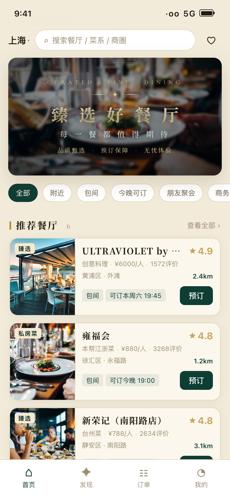
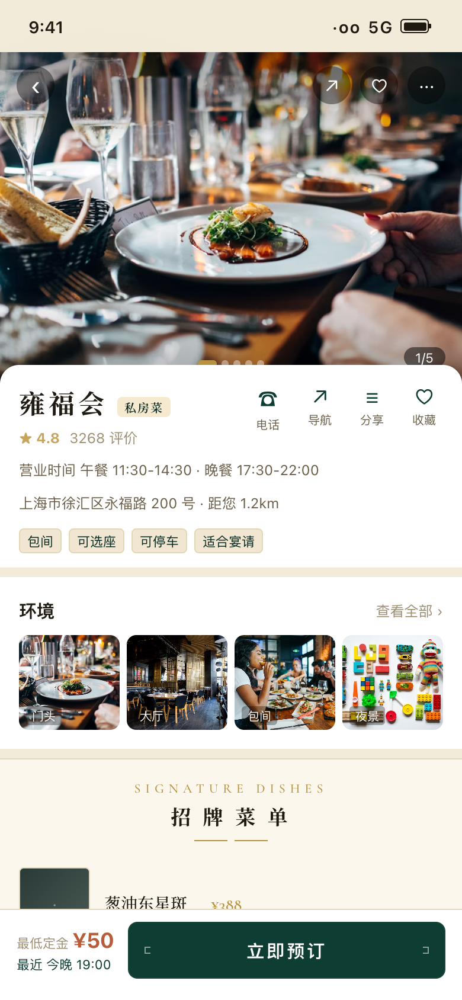
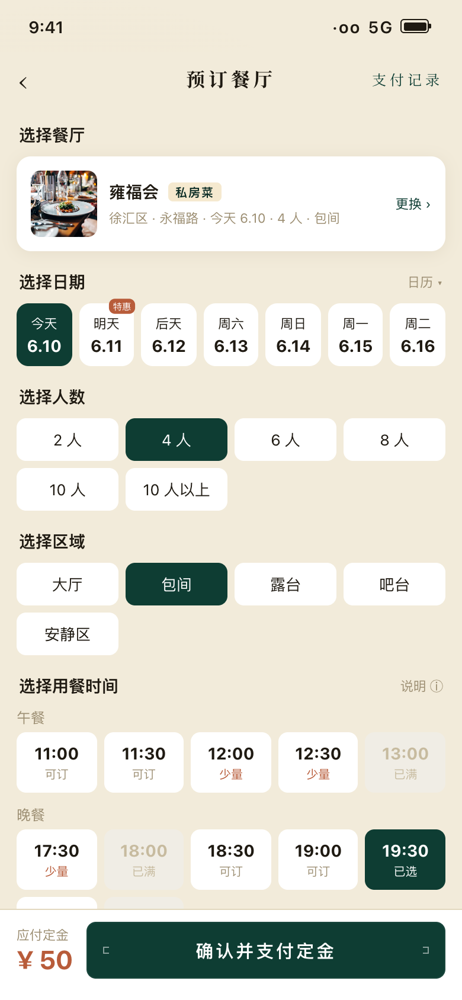
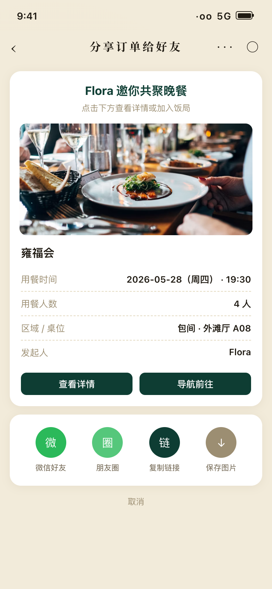
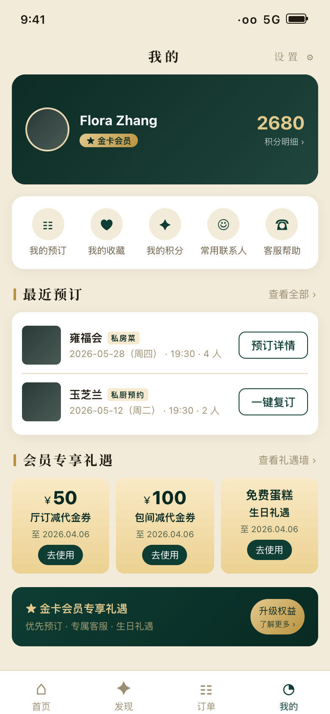

<h1 align="center">🍽 Premium Seat · Consumer App</h1>

<p align="center"><b>每一餐都值得期待 · Every meal worth the wait</b></p>
<p align="center"><i>The consumer-facing (C-side) app of the Premium Seat restaurant-reservation platform — where diners discover restaurants, pick seats on a floor plan, and lock tables with a deposit</i></p>

<p align="center">
  <a href="./README.md"></a>
  <a href="./README.en.md"></a>
</p>

<p align="center">
  
  
  
  
</p>

---

## 📱 Screenshots

<p align="center">
  
  
  
  
  
</p>
<p align="center"><sub>Home · Restaurant detail · Floor-plan seat picker · Share with friends · Profile (live data from Supabase)</sub></p>

## 🌟 About

This is the **consumer app** of the three-sided **Premium Seat** platform. Built for city dining occasions, it turns *"where to eat, when, which seat, with whom, and is it guaranteed?"* into one complete reservation journey — diners discover top-rated restaurants, browse ambience and signature dishes, pick an exact table on an interactive floor plan by date / party size / time slot, lock the seat with a deposit, receive a check-in QR code, and share the booking with friends. The merchant console handles fulfilment and the platform console handles operations, all three sharing one database in real time.

## ✨ Features

| Module | Highlights |
|--------|-----------|
| 🏠 Home | Depth-of-field hero, quick filters (nearby / private room / tonight / occasions), curated picks |
| 🍽 Restaurant detail | Cover gallery, menu-style signature dishes with dotted price leaders, private rooms, ratings |
| 📅 Booking flow | Date / party / area / slot steps + **SVG floor-plan seat picker** (capacity-aware) |
| 💳 Deposit lock | From ¥50, deducted on-site, transparent refund policy |
| 📋 Orders | 4-state lifecycle, check-in QR, **3 cancellations per month** |
| ⭐ Membership | Points, favorites (restaurants + dishes), coupons, saved contacts |

## 🚀 Quick start

```bash
npm install --prefix booking-app
cp booking-app/.env.example booking-app/.env   # fill in your Supabase URL & key
npm run dev --prefix booking-app               # → http://localhost:5173
```

Database setup: run `supabase-setup/001_schema.sql` and `002_seed.sql` in the Supabase SQL Editor, then `node supabase-setup/load_data.mjs` for demo data.

## 🛠 Tech stack

React 18 · Vite 5 · React Router (HashRouter, no server fallback needed) · Supabase (PostgreSQL + Auth) · pure-CSS design tokens (deep green `#0E3D33` + antique gold `#C8A55C`, fine-dining menu aesthetic)

## 🔗 Sibling repositories

| Repo | Role |
|------|------|
| **premium-seat-booking-app** (this repo) | Consumer app (C-side) |
| [premium-seat-merchant-app](https://github.com/QingMXL/premium-seat-merchant-app) | Merchant console (B-side): confirm bookings, check-in, tables & dishes |
| [Premium-Seat---Admin](https://github.com/QingMXL/Premium-Seat---Admin) | Platform console (operations): restaurants, merchants, orders & users |

## 📄 License

MIT © 2026
