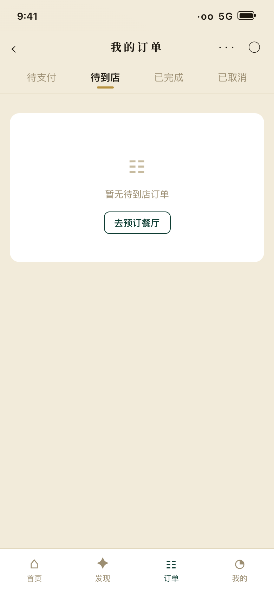

<h1 align="center">🍽 臻选餐厅预订 · 用户端</h1>

<p align="center"><b>每一餐都值得期待 · Every meal worth the wait</b></p>
<p align="center"><i>「臻选餐厅预订」平台的消费者端（C 端）—— 食客发现餐厅、平面图选座、定金锁座的预订入口</i></p>

<p align="center">
  <a href="./README.md"></a>
  <a href="./README.en.md"></a>
</p>

<p align="center">
  
  
  
  
</p>

---

## 📱 界面预览

<p align="center">
  
  
  
  
</p>
<p align="center"><sub>首页 · 餐厅详情 · 平面图选座 · 我的订单（数据实时来自 Supabase）</sub></p>

## 🌟 项目简介

这是「**臻选餐厅预订**」三端平台中的**用户端**：面向城市聚餐场景的食客，把"去哪吃、几点吃、坐哪里、和谁去、是否有保障"做成一条完整的预订链路 —— 用户在这里发现高分餐厅、查看环境与招牌菜、按日期/人数/时段在交互式平面图上选定桌位，支付定金锁座后获得到店核销码，并可将订单分享给同行好友；商家端接单履约、平台端统一运营，三端共享同一数据库，数据实时互通。

## ✨ 核心功能

| 模块 | 功能 |
|------|------|
| 🏠 首页 | 景深主图、快捷筛选（附近/包间/今晚可订/场景）、推荐餐厅、热门场景 |
| 🍽 餐厅详情 | 封面轮播、菜单风招牌菜（虚线点连价格）、包间一览、口碑评分 |
| 📅 预订流程 | 日期/人数/区域/时段四步选择 + **SVG 平面图选座**（容量与人数联动） |
| 💳 定金锁座 | ¥50 起、可抵到店消费、退款规则透明 |
| 📋 订单 | 待支付/待到店/已完成/已取消四态、核销二维码、**取消每月限 3 次** |
| ⭐ 会员 | 积分、收藏（店+菜）、礼遇券、常用联系人 |

## 🚀 快速开始

```bash
npm install --prefix booking-app
cp booking-app/.env.example booking-app/.env   # 填入 Supabase URL 与 Key
npm run dev --prefix booking-app               # → http://localhost:5173
```

数据库初始化：在 Supabase SQL Editor 依次执行 `supabase-setup/001_schema.sql`、`002_seed.sql`，再运行 `node supabase-setup/load_data.mjs` 填充演示数据。

## 🛠 技术栈

React 18 · Vite 5 · React Router（HashRouter，免后端 fallback）· Supabase（PostgreSQL + Auth）· 纯 CSS 设计令牌（深绿 `#0E3D33` + 古铜金 `#C8A55C` 菜单风）

## 🔗 同系列仓库

| 仓库 | 角色 |
|------|------|
| **premium-seat-booking-app**（本仓库） | 用户端（C 端） |
| [premium-seat-merchant-app](https://github.com/QingMXL/premium-seat-merchant-app) | 商家端（B 端）：接单确认、到店核销、桌台菜品管理 |

## 📄 License

MIT © 2026
