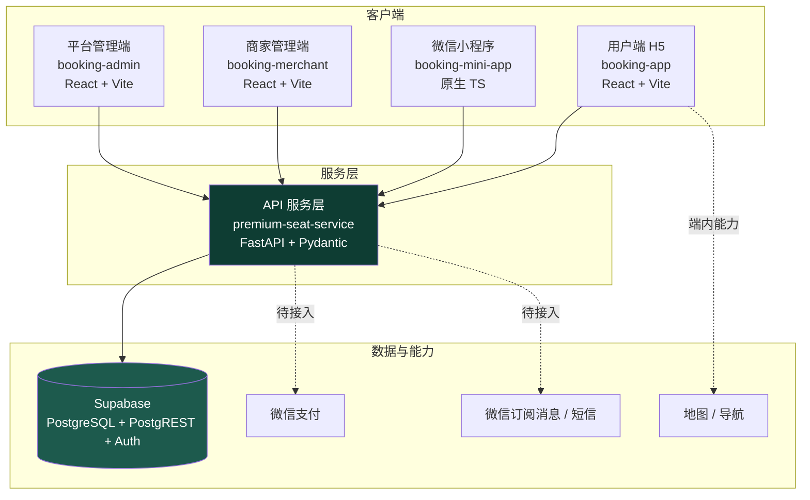
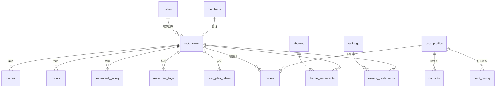
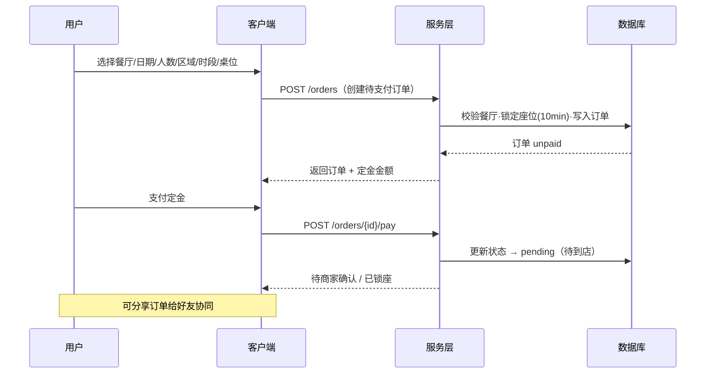
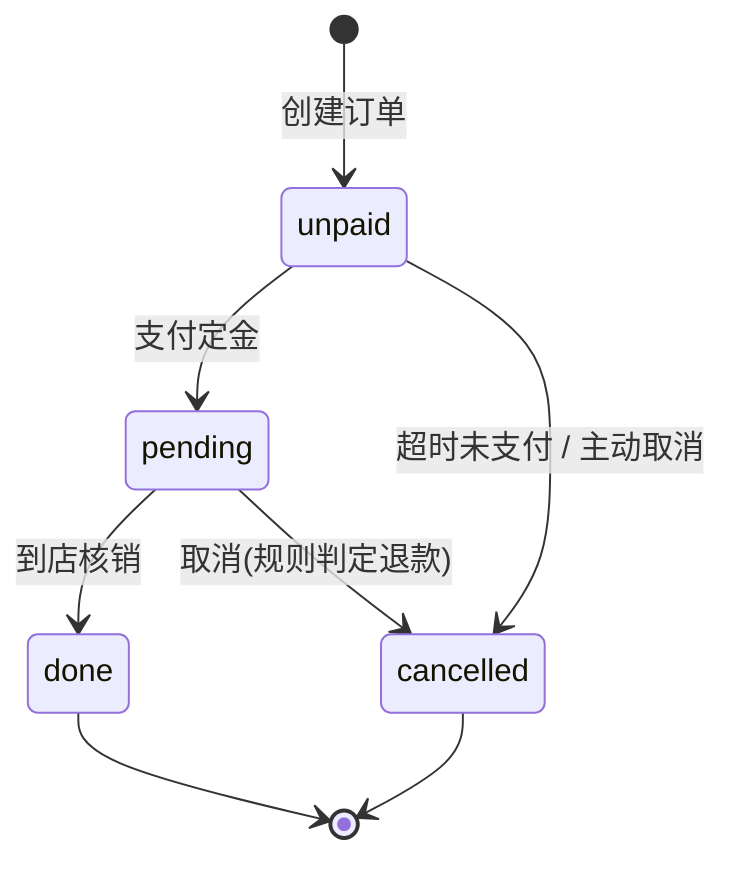

# 臻选餐厅预订平台 · 系统设计说明文档

| 项目 | 内容 |
|------|------|
| 文档版本 | v1.0 |
| 适用范围 | 用户端 H5 / 微信小程序 / 商家管理端 / 平台管理端 / API 服务层 / 数据库 |
| 产品定位 | 面向城市聚餐场景的餐厅预订平台 |
| 一句话总结 | 用户按城市、餐厅、菜品、日期、人数、时段、座位类型快速完成预订，并通过定金锁定座位；商家管理桌位、包间、时段与订单履约；平台统一运营与风控。 |

---

## 1. 产品概述

### 1.1 定位
本产品不是简单的餐厅列表工具，而是一个围绕"**去哪吃、几点吃、坐哪里、和谁去、是否有保障**"的完整预订服务系统。核心价值是帮助用户**更确定、更高效、更有保障**地完成一次饭局安排。

### 1.2 三方目标

| 角色 | 核心目标 |
|------|---------|
| **用户** | 快速找到合适餐厅；清楚位置/环境/菜品/可订时段/座位；支持定金锁座、订单分享、收藏、积分 |
| **商家** | 提前获得预订信息提高翻台效率；管理营业时间/时段/桌位/包间/定金/取消规则；确认订单、到店核销 |
| **平台** | 建立城市餐厅预订入口；通过推荐/收藏/积分/分享形成留存；通过定金/服务费/会员/营销实现商业化 |

---

## 2. 系统总览

整体为「**四前端 + 一服务层 + 一数据库**」的分层架构。所有客户端不直连数据库，统一经由 API 服务层访问，密钥收归服务端。



> **演进说明**：当前各前端在开发阶段直连 Supabase（service_role，仅开发用）。`premium-seat-service` 已建立统一服务层，是生产形态的目标路径 —— 密钥仅存服务端，业务逻辑集中。客户端逐步切换为调用服务层。

### 2.1 各模块职责与技术栈

| 模块 | 仓库 / 目录 | 技术栈 | 职责 |
|------|------------|--------|------|
| 用户端 H5 | `booking-app` | React 18 · Vite 5 · React Router · 纯 CSS | C 端发现/预订/订单/我的；可部署 Vercel |
| 微信小程序 | `booking-mini-app` | 原生小程序 · TypeScript · WXML/WXSS | C 端小程序形态，内置数据可零配置预览 |
| 商家管理端 | `booking-merchant` | React 18 · Vite 5 · Supabase | 餐厅资料/桌位/时段/订单确认/核销 |
| 平台管理端 | `booking-admin` | React 18 · Vite 5 · Supabase | 数据大盘/餐厅/商家/订单/用户/内容运营 |
| API 服务层 | `premium-seat-service` | FastAPI · Pydantic v2 · httpx | 统一 REST 接口、鉴权、业务规则、数据源抽象 |
| 数据库 | `supabase-setup` | PostgreSQL · RLS · Auth | 17 张表 + 行级安全策略 + 三类账户体系 |

---

## 3. 数据模型

### 3.1 表清单（17 张）

| 分类 | 表 | 说明 |
|------|----|----|
| 目录 | `cities` | 城市（热门标记） |
| 目录 | `restaurants` | 餐厅主表（评分、设施、口碑分、是否启用平面图） |
| 目录 | `restaurant_tags` | 餐厅标签（多对多） |
| 目录 | `restaurant_gallery` | 餐厅图集 |
| 目录 | `dishes` | 菜品（热门标记、点赞数） |
| 目录 | `rooms` | 包间（容量、最低消费） |
| 目录 | `floor_plan_tables` | 平面图桌位（坐标、形状、容量） |
| 内容 | `themes` / `theme_restaurants` | 主题集合及关联 |
| 内容 | `rankings` / `ranking_restaurants` | 榜单及关联 |
| 用户 | `user_profiles` | 用户资料（关联 auth.users） |
| 用户 | `contacts` | 常用联系人 |
| 用户 | `point_history` | 积分流水 |
| 交易 | `orders` | 订单（状态机 unpaid/pending/done/cancelled） |
| 账户 | `merchants` | 商家账户（auth.users ↔ restaurant） |
| 账户 | `platform_admins` | 平台管理员账户 |

### 3.2 核心关系



### 3.3 订单关键字段

`orders`：`id, user_id, restaurant_id, status, booking_date, booking_time, party_size, area, table_label, deposit, consumed, cancel_reason, refund_status, reviewed, created_at`

---

## 4. API 服务层设计

### 4.1 分层架构（仓储模式）

```
路由 routers/  →  仓储接口 Repository  →  ├── MockRepository（内存，零配置）
（catalog/orders/                          └── SupabaseRepository（PostgREST）
  auth/merchant/admin）                   ↑ DATA_SOURCE 环境变量切换，业务零改动
```

- **响应信封**：成功 `{ success, data, error:null }`；分页附 `meta:{total,page,limit}`；失败 `{ success:false, data:null, error:{code,message} }`
- **字段风格**：对外统一 camelCase（Pydantic alias 自动转换）
- **校验**：Pydantic v2 在入口校验，非法入参统一返回 422 信封
- **鉴权**：`Authorization: Bearer`（Supabase 模式校验真实登录态）；商家/平台接口经角色守卫

### 4.2 端点总览（前缀 `/api/v1`）

| 分组 | 代表端点 |
|------|---------|
| 元信息 | `GET /health` |
| C 端目录 | `GET /cities` · `/restaurants` · `/restaurants/{id}` · `/restaurants/{id}/availability` · `/dishes/trending` · `/discover/themes` · `/discover/rankings` |
| C 端订单 | `GET/POST /orders` · `GET /orders/{id}` · `POST /orders/{id}/pay` · `POST /orders/{id}/cancel` |
| 鉴权 | `POST /auth/login` · `POST /auth/wechat` |
| 商家端 | `GET /merchant/orders` · `POST /merchant/orders/{id}/confirm` · `/checkin` |
| 平台端 | `GET /admin/stats` · `/admin/orders` · `/admin/restaurants` · `/admin/users` |

---

## 5. 核心业务流程

### 5.1 预订主流程



### 5.2 订单状态机



状态文案：`unpaid 待支付` / `pending 待到店` / `done 已完成` / `cancelled 已取消`。

### 5.3 取消与退款规则
- 用餐前 **2 小时**以上取消：定金原路退还；超过取消时间：不退或部分退
- 商家原因取消：原路退还 + 补偿优惠券/积分
- **每位用户每月最多取消 3 次**（服务层 `MONTHLY_CANCEL_LIMIT`，超限拒绝）
- 座位保留 15 分钟，迟到可在订单内提示商家

### 5.4 商家确认模式
- **自动确认**：桌位库存清晰、规则稳定的普通大厅
- **人工确认**：包间 / 大桌 / 商务宴请 / 特殊日期
- 到店核销 → 订单置为 `done`，定金按规则抵扣消费

---

## 6. 设计语言（UI 规范）

整体风格：**高级餐厅菜单风**（Editorial / 餐饮质感），克制、信息清晰、强预订感。

### 6.1 色板（Design Token）

| Token | 值 | 用途 |
|-------|----|----|
| `--c-primary` | `#0E3D33` 深绿 | 主色、按钮、导航 |
| `--c-gold` / `--c-gold-bright` | `#B8923F` / `#C8A55C` 古铜金 | 强调、装饰线、价格 |
| `--c-bg` | `#F2EBDA` 米黄纸质 | 背景 |
| `--c-card` | `#FBF7EC` | 卡片 |
| `--c-warn` | `#B85C3A` | 定金 / 警示 |

### 6.2 字体
- 中文衬线：**Noto Serif SC**（标题 / 餐厅名）
- 西文衬线：**Cormorant Garamond**（英文小标 / 价格）
- 正文：系统 PingFang SC

### 6.3 关键规范
- 章节标题前置金色竖线；招牌菜用"菜单虚线点连价格"
- 首页主图做景深（模糊 + 暗角）突出标题
- 仅"待支付"订单显示红色未读角标；其余 Tab 不堆数字
- 预订平面图：圆/方桌 + 椅子，桌位容量与所选人数联动（不足置灰）
- 动效仅用 `transform`/`opacity`（GPU 合成层）

---

## 7. 安全设计

| 层面 | 措施 |
|------|------|
| 密钥 | `service_role` 仅存服务端环境变量；客户端永不内嵌；`.env` 入 `.gitignore` |
| 数据库 | 行级安全（RLS）：公开表只读；用户私有数据（订单/积分/联系人）仅本人；商家仅本店；平台管理员经 `is_platform_admin()` 全量 |
| 服务层 | 统一鉴权与角色守卫；Pydantic 边界校验；错误信封不泄露内部细节 |
| 账户分级 | 三类账户：`user_profiles`（C 端）/ `merchants`（B 端）/ `platform_admins`（平台） |
| 待生产化 | 商家/平台角色校验落库、取消月限改 DB/Redis、微信支付回调验签 |

---

## 8. 部署架构

| 模块 | 部署方式 |
|------|---------|
| 用户端 H5 / 商家端 / 平台端 | 静态产物（HashRouter），Vercel / Netlify / Nginx / OSS |
| 微信小程序 | 微信开发者工具上传 → 审核发布；图片域名加白名单 |
| API 服务层 | uvicorn（生产前置 gunicorn/uvicorn workers）；Docker 或服务器；env 设 `DATA_SOURCE=supabase` |
| 数据库 | Supabase 托管（PostgreSQL + Auth + PostgREST） |

---

## 9. 分阶段路线图

### 9.1 MVP（已完成 / 进行中）
- 用户端：城市/餐厅列表/详情/日期人数时段区域/平面图选座/50 元定金/订单/收藏/分享/搜索
- 商家端：餐厅资料/桌位时段配置/订单查看确认/到店核销
- 平台端：餐厅管理/订单管理/数据大盘/用户管理
- 服务层：统一 REST + 仓储双数据源 + 鉴权骨架
- 小程序：用户端全流程移植（内置数据）

### 9.2 第二阶段
- 可交互平面图选座落库、候补提醒、积分兑换、会员等级、菜品收藏、主题榜单个性化、优惠券、商家数据看板
- 小程序接入服务层（`wx.request` + 域名白名单）+ 微信登录 `jscode2session`

### 9.3 第三阶段
- 多人协同饭局、AA 预付/代付定金、商务宴请需求单、大桌/包间智能匹配、餐厅私域会员打通、企业宴请账户、微信支付正式接入

---

## 10. 仓库索引

| 仓库 | 说明 |
|------|------|
| `Premium-Seat---Restaurant-Reservation` | 用户端 H5 + 商家端 + 平台端 + 数据库脚本 + 本设计文档 |
| `premium-seat-service` | FastAPI 统一 API 服务层 |
| `booking-mini-app` | 微信小程序（用户端形态） |

---

> 本文档随系统演进持续更新。架构图、ER 图、流程图均为 Mermaid，可在 GitHub 直接渲染，也便于后续编辑。
